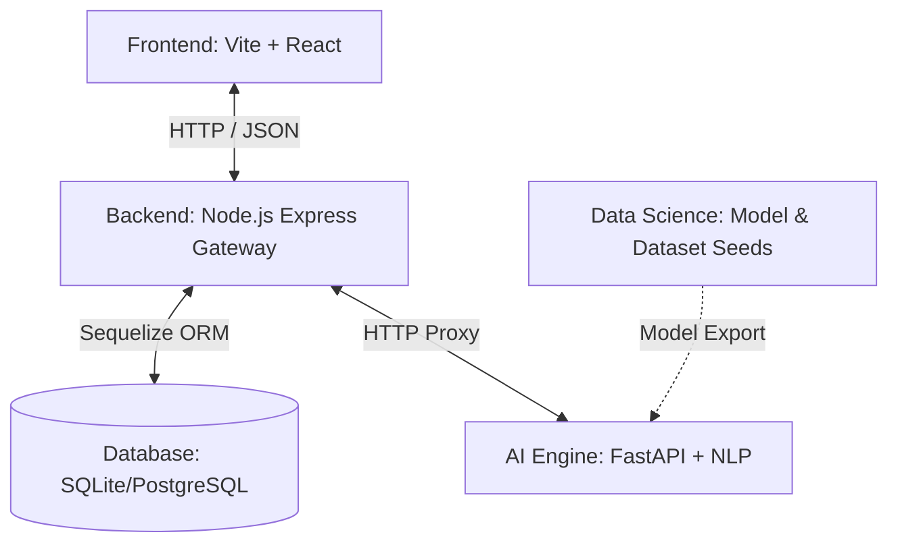

# 🌌 Career Diagnostic System

Sistem Analisis Prediktif Kesenjangan Keterampilan Berbasis NLP (Natural Language Processing) untuk Bidang Teknologi & Computer Science. Platform ini memindai CV (dalam format PDF), mencocokkannya dengan kualifikasi standar industri untuk profesi target, menghitung skor kecocokan (_match score_), memetakan keahlian yang teridentifikasi, mengidentifikasi kesenjangan keterampilan (_skill gaps_), serta menyediakan asisten AI Chatbot untuk panduan perbaikan karier secara interaktif.

---

## 🏛️ Arsitektur Proyek

Sistem ini dibangun menggunakan arsitektur modular yang membagi tanggung jawab antara antarmuka pengguna, gerbang API, mesin kecerdasan buatan, dan riset data science:



1. **`frontend/`** (Vite + React + Tailwind CSS): Dashboard klien premium dengan estetika modern, transisi halus, widgets chat interaktif, dan penanganan layar unggah CV yang responsif.
2. **`backend/`** (Node.js + Express + Sequelize): Gateway utama untuk autentikasi pengguna (JWT), manajemen riwayat pencarian, penyimpanan relasi riwayat-keterampilan dinamis, dan proxy komunikasi ke AI Engine.
3. **`ai_engine/`** (FastAPI + Python): Mesin inti kecerdasan buatan yang mengoperasikan algoritma ekstraksi teks NLP untuk memetakan CV terhadap standar industri serta agen chatbot interaktif.
4. **`data_science/`** (Python + Jupyter): Ruang kerja riset untuk analisis dataset, pembuatan model klasifikasi, pembersihan kata kunci (_keywords_), dan eksperimen pemetaan keterampilan.

---

# 🚀 Langkah Instalasi & Menjalankan Proyek

Pastikan komputer Anda telah terinstal:

- **Node.js v18+**
- **Python 3.9+**
- **Git**

---

## 1️⃣ Clone Repository

```bash
git clone <repository-url>
cd <nama-folder-project>
```

## 2️⃣ Menjalankan AI Engine (`ai_engine/`)

AI Engine bertanggung jawab untuk proses NLP, analisis CV, ekstraksi skill, dan chatbot AI.

```bash
cd ai_engine

# Membuat Virtual Environment
python -m venv venv

# Aktivasi Virtual Environment (Windows)
venv\Scripts\activate

# Install Dependencies
pip install -r requirements.txt

# Menjalankan FastAPI Server
cd src
uvicorn api:app --reload
```

📍 AI Engine berjalan di:

```txt
http://localhost:8000
```

---

## 3️⃣ Menjalankan Backend Gateway (`backend/`)

Backend berfungsi sebagai API Gateway, autentikasi JWT, database persistence, dan penghubung frontend dengan AI Engine.

```bash
cd backend

# Copy file environment
cp .env.example .env

# Install Dependencies
npm install

# Menjalankan Seeder Database
npx sequelize-cli db:seed:all

# Menjalankan Development Server
npm run dev
```

📍 Backend berjalan di:

```txt
http://localhost:5000
```

---

## 4️⃣ Menjalankan Frontend Dashboard (`frontend/`)

Frontend menggunakan Vite + React untuk menyediakan antarmuka pengguna modern dan interaktif.

```bash
cd frontend

# Install Dependencies
npm install

# Menjalankan Vite Development Server
npm run dev
```

📍 Frontend berjalan di:

```txt
http://localhost:5173
```

---

## 🌟 Fitur Utama Unggulan

- **Scanan CV Real-Time:** Unggah CV berbentuk PDF, pilih target profesi, dan dapatkan analisis kecocokan instan tanpa delay buatan (_non-blocking dynamic progression_).
- **Pemetaan Kesenjangan Keahlian Komprehensif:** Mengidentifikasi keterampilan yang sudah cocok serta memetakan _skill gaps_ secara dinamis dari database tanpa ada data kustom yang terbuang (_dynamic Skill auto-creation_).
- **Asisten AI Chatbot Interaktif:** Obrolan langsung dengan AI yang peka konteks (_context-aware_), langsung memahami hasil laporan CV Anda untuk memberikan tips perbaikan portofolio.
- **Autentikasi Aman & Riwayat Dinamis:** Registrasi aman dilengkapi pencegahan duplikasi email secara visual, serta penyimpanan riwayat analisis terenkripsi JWT.
- **Bahasa Indonesia yang Natural:** Seluruh antarmuka dikemas menggunakan Bahasa Indonesia yang profesional namun tetap ramah dan modern.

---

## 📄 Lisensi

Proyek ini dibangun untuk tujuan pembelajaran camp pengodean karir (Career Coding Camp). Hak Cipta dilindungi undang-undang.
