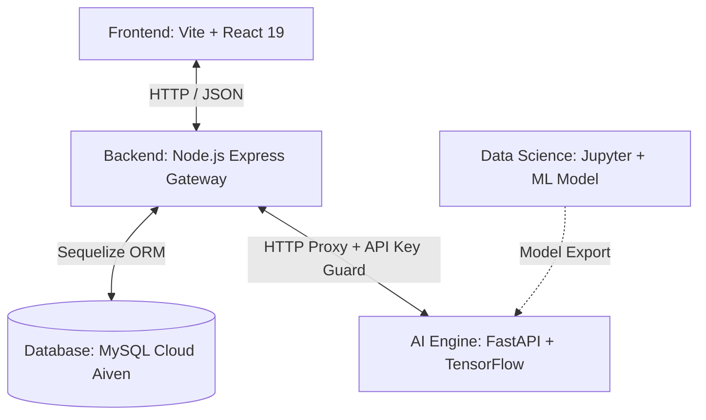

# 🌌 SkillPath AI - Career Diagnostic System

Sistem Analisis Prediktif Kesenjangan Keterampilan Berbasis NLP (Natural Language Processing) untuk Bidang Teknologi & Computer Science. Platform ini memindai CV (dalam format PDF), mencocokkannya dengan kualifikasi standar industri untuk profesi target, menghitung skor kecocokan (_match score_), memetakan keahlian yang teridentifikasi, mengidentifikasi kesenjangan keterampilan (_skill gaps_), serta menyediakan asisten AI Chatbot untuk panduan perbaikan karier secara interaktif.

---

## 🏛️ Arsitektur Proyek

Sistem ini dibangun menggunakan arsitektur modular yang membagi tanggung jawab antara antarmuka pengguna, gerbang API, mesin kecerdasan buatan, dan riset data science:



1. **`frontend/` (Vite + React 19 + Tailwind CSS v4):** Dashboard klien premium dengan estetika modern, transisi halaman halus menggunakan Framer Motion v12, widget chat interaktif, dan penanganan layar unggah (upload) CV PDF yang responsif.
2. **`backend/` (Node.js + Express v5 + Sequelize):** API Gateway utama untuk autentikasi pengguna (JWT Stateless), manajemen riwayat pencarian, penyimpanan relasi riwayat-keterampilan dinamis di MySQL Cloud, dan proxy komunikasi aman ke AI Engine dengan pengiriman email nyata menggunakan Nodemailer SMTP.
3. **`ai_engine/` (FastAPI + TensorFlow 2.21 + Keras):** Mesin inti kecerdasan buatan yang mengoperasikan model klasifikasi khusus (Custom Classifier) & Named Entity Recognition (NER) untuk memetakan CV terhadap standar industri serta mengintegrasikan Groq Cloud API (Llama 3) untuk agen chatbot interaktif. Hosted secara aman di Hugging Face Spaces.
4. **`data_science/` (Python + Jupyter Notebook):** Ruang kerja riset untuk pemodelan klasifikasi pekerjaan, pembersihan kata kunci (_keywords_) dataset lowongan kerja (JobStreet), dan eksperimen pemetaan keterampilan.

---

## 🚀 Teknologi yang Digunakan (Tech Stack)

### 💻 Frontend

- **Core:** React 19, HTML5, Vanilla JavaScript.
- **Build Tool & Server:** Vite v8 (kecepatan kompilasi & HMR instan).
- **Styling:** Tailwind CSS v4 & CSS kustom (Glassmorphism, ambient gradients).
- **Animations:** Framer Motion v12 (transisi halaman & efek spring).
- **Icons:** Lucide React (ikon minimalis berkualitas tinggi).
- **Branding:** Favicon kustom terintegrasi (.svg & .ico) di seluruh halaman UI.
- **Deployment:** Vercel Production.

### ⚙️ Backend Gateway

- **Framework:** Express v5 (Node.js runtime).
- **Database ORM:** Sequelize v6 (MySQL database engine).
- **Database Engine:** MySQL Cloud (Aiven Cloud Services).
- **Authentication:** JSON Web Token (JWT) stateless & Bcryptjs.
- **Email Dispatch:** Nodemailer SMTP Email (mendukung integrasi email riil seperti Gmail App Password & STARTTLS).
- **File Processing:** Multer (multipart upload) & PDF-parse (ekstraksi teks PDF lokal).
- **HTTP Client:** Axios (menghubungkan proxy API ke AI Engine secara aman).
- **Deployment:** Vercel Production.

### 🧠 AI Engine

- **Framework:** FastAPI & Uvicorn (Python 3.9+).
- **Deep Learning:** TensorFlow 2.21.0 & Keras (Custom Classifier & NER models).
- **Machine Learning & Data Processing:** Scikit-learn v1.8.0, Pandas v3.0.2, Numpy v2.4.4.
- **Generative AI Agent:** Groq Cloud API (Llama 3) untuk asisten chatbot kustom.
- **Rate Limiting:** Slowapi (mencegah kelebihan beban API).
- **Machine Learning Tracking:** Weights & Biases (W&B) untuk mencatat hasil training model.
- **Hosting:** Hugging Face Spaces (dengan pengamanan API Key & Guardrails).

---

## 🏃 Langkah Instalasi & Menjalankan Proyek

Pastikan komputer Anda telah terinstal:

- **Node.js v18+**
- **Python 3.9+**
- **Git**

---

### 1️⃣ Clone Repository & Setup Git

```bash
git clone <repository-url>
cd career-diagnostic-system
```

### 2️⃣ Menjalankan AI Engine (`ai_engine/`)

AI Engine bertanggung jawab untuk proses NLP, klasifikasi CV, ekstraksi skill, dan chatbot AI.

File model dan dataset tidak disertakan langsung di dalam repository karena ukuran file cukup besar.
Silakan unduh model melalui tautan Google Drive berikut:

[Download Model](https://drive.google.com/drive/u/1/folders/1CjLhVNm2jlByMSneP5yuIcsrnnHGU6Fa)
[Download full data](https://drive.google.com/drive/folders/1mQmgj-EbrIIAD_WBxBgbkPZeNCJMbySr)

Setelah mengunduh file model dan full dataset, letakkan file tersebut ke dalam folder yang sesuai dengan struktur proyek:

Models: ai_engine/models/
Data: ai_engine/data/

Pastikan nama file model sesuai dengan nama file yang dipanggil di dalam kode program agar aplikasi dapat berjalan dengan benar.

```bash
cd ai_engine

# Membuat Virtual Environment
python -m venv venv

# Aktivasi Virtual Environment (Windows)
venv\Scripts\activate

# Install Dependencies
pip install -r requirements.txt

# Menjalankan FastAPI Server
cd src
uvicorn api:app --reload
```

📍 AI Engine lokal berjalan di: `http://localhost:8000`

---

### 3️⃣ Menjalankan Backend Gateway (`backend/`)

Backend berfungsi sebagai API Gateway, autentikasi JWT, database persistence, dan penghubung frontend dengan AI Engine.

```bash
cd backend

# Salin file environment
cp .env.example .env

# Jalankan instalasi dependensi
npm install

# Menjalankan Seeder Database
npx sequelize-cli db:seed:all

# Menjalankan Development Server
npm run dev
```

📍 Backend lokal berjalan di: `http://localhost:5000`

---

### 4️⃣ Menjalankan Frontend Dashboard (`frontend/`)

Frontend menyediakan antarmuka pengguna modern dan interaktif.

```bash
cd frontend

# Install Dependencies
npm install

# Menjalankan Vite Development Server
npm run dev
```

📍 Frontend lokal berjalan di: `http://localhost:5173`

---

## 🌟 Fitur Utama Unggulan

- **Upload & Scan CV Real-Time:** Unggah CV berbentuk PDF, pilih target profesi, dan dapatkan analisis kecocokan instan tanpa delay buatan (_non-blocking dynamic progression_).
- **Pemetaan Kesenjangan Keahlian Komprehensif:** Mengidentifikasi keterampilan yang sudah cocok serta memetakan _skill gaps_ secara dinamis dari database tanpa ada data kustom yang terbuang.
- **Asisten AI Chatbot Interaktif:** Obrolan langsung dengan AI yang peka konteks (_context-aware_), langsung memahami hasil laporan CV Anda untuk memberikan tips perbaikan portofolio.
- **Keamanan Autentikasi Modern (Forgot & Reset Password):**
  - Alur lupa kata sandi riil terintegrasi penuh lewat email SMTP Nodemailer & stateless JWT token.
  - Ikon mata _toggle_ visibilitas kata sandi di layar masuk, daftar, dan reset kata sandi baru.
  - Mitigasi serangan _User Enumeration_ pada kesalahan login/register dengan menyamakan pesan galat (_"Email atau password salah"_).
- **Disclaimer Transparansi AI:** Spanduk formal pada halaman laporan yang memperjelas bahwa hasil analisis berbasis kecerdasan buatan bersifat estimasi pendukung keputusan dan tidak dijamin 100% akurat.

---

## 📄 Lisensi

Proyek ini dibangun untuk tujuan pembelajaran camp pengodean karir (Career Coding Camp). Hak Cipta dilindungi undang-undang.
